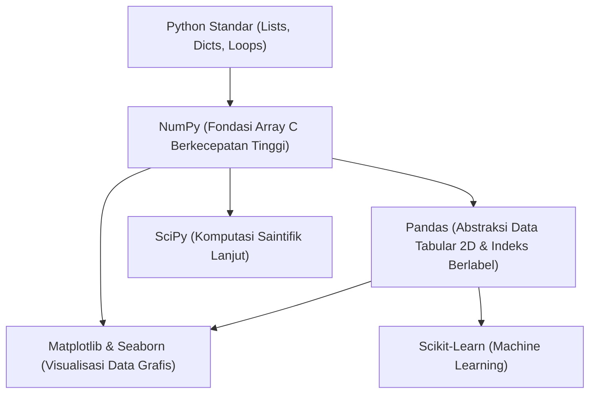

# Panduan Lengkap NumPy dan Pandas untuk Pengolahan Data

Dokumen ini merupakan panduan referensi komprehensif mengenai **NumPy** dan **Pandas**, dua pustaka (*library*) fondasional dalam ekosistem Python untuk analisis data, manipulasi tabular, komputasi saintifik, dan visualisasi data. Panduan ini dirancang untuk mendampingi berkas praktikum [Praktikum3_GathanHilabi_60324059.ipynb](file:///c:/Users/LENOVO/Documents/PERSONAL%20GATHAN/PROJECT%202026/VISUALISASI%20DATA/VD_03/Praktikum3_GathanHilabi_60324059.ipynb).

---

## 📑 Daftar Isi

1. [Pendahuluan: Ekosistem Python untuk Sains Data](#1-pendahuluan-ekosistem-python-untuk-sains-data)
2. [Bagian I: Panduan Lengkap NumPy](#2-bagian-i-panduan-lengkap-numpy)
   - [2.1 Mengapa NumPy Dibutuhkan?](#21-mengapa-numpy-dibutuhkan)
   - [2.2 Objek Inti: ndarray](#22-objek-inti-ndarray)
   - [2.3 Pembuatan Array](#23-pembuatan-array)
   - [2.4 Operasi Matematika & Vektorisasi](#24-operasi-matematika--vektorisasi)
   - [2.5 Fungsi Statistik dan Agregasi](#25-fungsi-statistik-dan-agregasi)
   - [2.6 Indexing, Slicing, dan Filtering](#26-indexing-slicing-dan-filtering)
   - [2.7 Komparasi Presisi Numerik](#27-komparasi-presisi-numerik)
   - [2.8 Bedah Kode NumPy pada Praktikum 3](#28-bedah-kode-numpy-pada-praktikum-3)
3. [Bagian II: Panduan Lengkap Pandas](#3-bagian-ii-panduan-lengkap-pandas)
   - [3.1 Filosofi dan Konsep Dasar Pandas](#31-filosofi-dan-konsep-dasar-pandas)
   - [3.2 Struktur Data: Series vs DataFrame](#32-struktur-data-series-vs-dataframe)
   - [3.3 Input & Output Data Tabular](#33-input--output-data-tabular)
   - [3.4 Eksplorasi Awal Data (EDA Fundamentals)](#34-eksplorasi-awal-data-eda-fundamentals)
   - [3.5 Akses Kolom, Baris, dan Boolean Indexing](#35-akses-kolom-baris-dan-boolean-indexing)
   - [3.6 Pembersihan Data: Missing Value](#36-pembersihan-data-missing-value)
   - [3.7 Pembersihan Data: Duplikasi Baris](#37-pembersihan-data-duplikasi-baris)
   - [3.8 Bedah Kode Pandas pada Praktikum 3](#38-bedah-kode-pandas-pada-praktikum-3)
4. [Bagian III: Perbandingan dan Integrasi NumPy vs Pandas](#4-bagian-iii-perbandingan-dan-integrasi-numpy-vs-pandas)
   - [4.1 Matriks Perbandingan Fitur](#41-matriks-perbandingan-fitur)
   - [4.2 Hubungan Arsitektur: Bagaimana Keduanya Bekerja Sama](#42-hubungan-arsitektur-bagaimana-keduanya-bekerja-sama)
   - [4.3 Kapan Menggunakan NumPy vs Pandas?](#43-kapan-menggunakan-numpy-vs-pandas)
5. [Bagian IV: Cheatsheet Sintaks Cepat (Quick Reference)](#5-bagian-iv-cheatsheet-sintaks-cepat-quick-reference)
6. [Referensi Resmi](#6-referensi-resmi)

---

## 1. Pendahuluan: Ekosistem Python untuk Sains Data

Python adalah bahasa tingkat tinggi yang sangat populer, tetapi implementasi standarnya (CPython) memiliki keterbatasan kecepatan eksekusi untuk perulangan (*loop*) berskala jutaan elemen. Untuk mengatasi hal ini, ekosistem komputasi saintifik Python dibangun di atas fondasi:

- **NumPy** menyediakan struktur data biner kontinu yang ditulis dalam bahasa C/Fortran untuk kalkulasi angka dalam kecepatan mesin.
- **Pandas** membungkus array NumPy ke dalam struktur tabel yang memiliki nama kolom (*header*) dan indeks baris, menyederhanakan manipulasi dataset nyata (seperti CSV, Excel, SQL).

---
