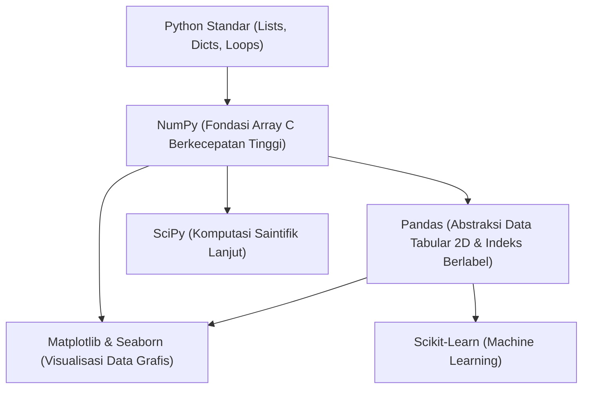
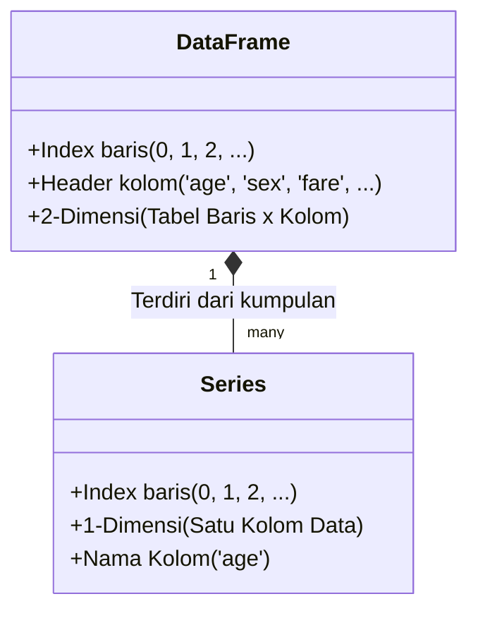
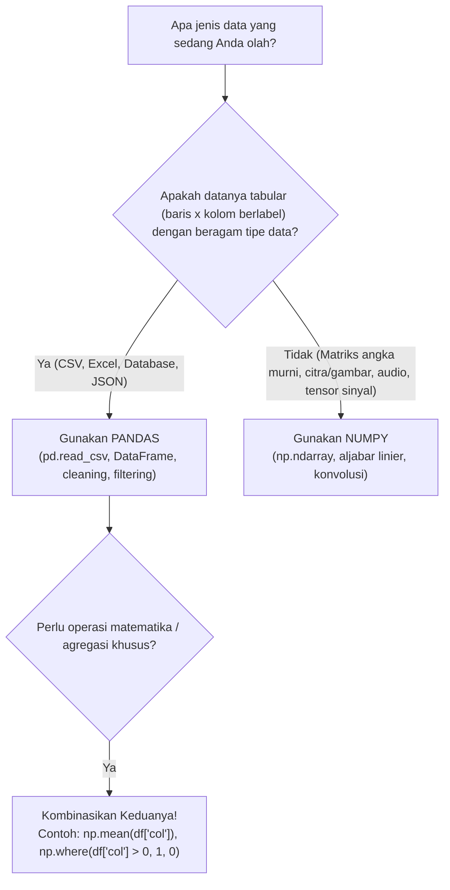

# Panduan Lengkap NumPy dan Pandas untuk Pengolahan Data

Dokumen ini merupakan panduan referensi komprehensif mengenai **NumPy** dan **Pandas**, dua pustaka (*library*) fondasional dalam ekosistem Python untuk analisis data, manipulasi tabular, komputasi saintifik, dan visualisasi data. Panduan ini dirancang untuk mendampingi berkas praktikum [Praktikum3_GathanHilabi_60324059.ipynb](file:///c:/Users/LENOVO/Documents/PERSONAL%20GATHAN/PROJECT%202026/VISUALISASI%20DATA/VD_03/Praktikum3_GathanHilabi_60324059.ipynb).

---

## 📑 Daftar Isi

1. [Pendahuluan: Ekosistem Python untuk Sains Data](#1-pendahuluan-ekosistem-python-untuk-sains-data)
2. [Bagian I: Panduan Lengkap NumPy](#2-bagian-i-panduan-lengkap-numpy)
   - [2.1 Mengapa NumPy Dibutuhkan?](#21-mengapa-numpy-dibutuhkan)
   - [2.2 Objek Inti: ndarray](#22-objek-inti-ndarray)
   - [2.3 Pembuatan Array](#23-pembuatan-array)
   - [2.4 Operasi Matematika & Vektorisasi](#24-operasi-matematika--vektorisasi)
   - [2.5 Fungsi Statistik dan Agregasi](#25-fungsi-statistik-dan-agregasi)
   - [2.6 Indexing, Slicing, dan Filtering](#26-indexing-slicing-dan-filtering)
   - [2.7 Komparasi Presisi Numerik](#27-komparasi-presisi-numerik)
   - [2.8 Bedah Kode NumPy pada Praktikum 3](#28-bedah-kode-numpy-pada-praktikum-3)
3. [Bagian II: Panduan Lengkap Pandas](#3-bagian-ii-panduan-lengkap-pandas)
   - [3.1 Filosofi dan Konsep Dasar Pandas](#31-filosofi-dan-konsep-dasar-pandas)
   - [3.2 Struktur Data: Series vs DataFrame](#32-struktur-data-series-vs-dataframe)
   - [3.3 Input & Output Data Tabular](#33-input--output-data-tabular)
   - [3.4 Eksplorasi Awal Data (EDA Fundamentals)](#34-eksplorasi-awal-data-eda-fundamentals)
   - [3.5 Akses Kolom, Baris, dan Boolean Indexing](#35-akses-kolom-baris-dan-boolean-indexing)
   - [3.6 Pembersihan Data: Missing Value](#36-pembersihan-data-missing-value)
   - [3.7 Pembersihan Data: Duplikasi Baris](#37-pembersihan-data-duplikasi-baris)
   - [3.8 Bedah Kode Pandas pada Praktikum 3](#38-bedah-kode-pandas-pada-praktikum-3)
4. [Bagian III: Perbandingan dan Integrasi NumPy vs Pandas](#4-bagian-iii-perbandingan-dan-integrasi-numpy-vs-pandas)
   - [4.1 Matriks Perbandingan Fitur](#41-matriks-perbandingan-fitur)
   - [4.2 Hubungan Arsitektur: Bagaimana Keduanya Bekerja Sama](#42-hubungan-arsitektur-bagaimana-keduanya-bekerja-sama)
   - [4.3 Kapan Menggunakan NumPy vs Pandas?](#43-kapan-menggunakan-numpy-vs-pandas)
5. [Bagian IV: Cheatsheet Sintaks Cepat (Quick Reference)](#5-bagian-iv-cheatsheet-sintaks-cepat-quick-reference)
6. [Referensi Resmi](#6-referensi-resmi)

---

## 1. Pendahuluan: Ekosistem Python untuk Sains Data

Python adalah bahasa tingkat tinggi yang sangat populer, tetapi implementasi standarnya (CPython) memiliki keterbatasan kecepatan eksekusi untuk perulangan (*loop*) berskala jutaan elemen. Untuk mengatasi hal ini, ekosistem komputasi saintifik Python dibangun di atas fondasi:



- **NumPy** menyediakan struktur data biner kontinu yang ditulis dalam bahasa C/Fortran untuk kalkulasi angka dalam kecepatan mesin.
- **Pandas** membungkus array NumPy ke dalam struktur tabel yang memiliki nama kolom (*header*) dan indeks baris, menyederhanakan manipulasi dataset nyata (seperti CSV, Excel, SQL).

---

## 2. Bagian I: Panduan Lengkap NumPy

**NumPy** (*Numerical Python*) adalah pustaka standar de facto untuk komputasi numerik di Python.

```python
import numpy as np
```
> **Konvensi Standar:** Selalu gunakan alias `np` saat mengimpor NumPy.

### 2.1 Mengapa NumPy Dibutuhkan?

Perhatikan perbandingan antara **List Python Standar** dengan **NumPy Array**:

| Aspek | List Python Standar | NumPy Array (`ndarray`) |
| :--- | :--- | :--- |
| **Penyimpanan Memori** | Menyimpan pointer ke objek Python (tiap elemen memiliki overhead besar). | Data homogen disimpan berurutan (*contiguous memory block*) tanpa overhead pointer. |
| **Kecepatan Operasi** | Membutuhkan perulangan `for` eksplisit di level interpretasi Python. | Menggunakan komputasi vektor (*vectorized operations*) yang dikompilasi langsung di tingkat CPU/C. |
| **Tipe Data** | Heterogen (bisa mencampur `int`, `str`, `float` dalam satu list). | Homogen (seluruh elemen wajib bertipe data sama, misalnya `float64`). |
| **Dukungan Dimensi** | List di dalam list (kurang intuitif untuk operasi matriks multi-dimensi). | Mendukung N-dimensi secara native dengan manipulasi bentuk (*shape*) yang fleksibel. |

### 2.2 Objek Inti: `ndarray`

Objek utama dalam NumPy adalah `np.ndarray` (*N-dimensional array*). Atribut penting pada array:
- `array.ndim`: Menunjukkan jumlah dimensi (1D = vektor, 2D = matriks, 3D+ = tensor).
- `array.shape`: Tuple yang menyatakan ukuran di setiap dimensi, misal `(5,)` untuk 1D atau `(3, 4)` untuk 2D.
- `array.size`: Total banyaknya elemen di dalam array.
- `array.dtype`: Tipe data elemen (contoh: `int32`, `int64`, `float64`).

### 2.3 Pembuatan Array

```python
# 1. Dari list biasa
arr1 = np.array([10, 20, 30, 40])

# 2. Array 2 dimensi (matriks)
arr2d = np.array([[1, 2, 3], [4, 5, 6]])

# 3. Array dengan nilai awal seragam
nol = np.zeros((3, 3))       # matriks 3x3 berisi angka 0.0
satu = np.ones((2, 4))       # matriks 2x4 berisi angka 1.0

# 4. Rentang deret angka berurutan
rentang = np.arange(0, 10, 2)       # [0, 2, 4, 6, 8] (mirip range di Python)
linear = np.linspace(0, 1, 5)       # [0.0, 0.25, 0.5, 0.75, 1.0] (5 titik terbagi rata)
```

### 2.4 Operasi Matematika & Vektorisasi

Salah satu keunggulan terbesar NumPy adalah **operasi tanpa loop** (*vectorization*):

```python
a = np.array([1, 2, 3, 4])
b = np.array([10, 20, 30, 40])

# Operasi element-wise
print(a + b)   # array([11, 22, 33, 44])
print(a * 2)   # array([ 2,  4,  6,  8])  -> Broadcasting skalar
print(b / a)   # array([10., 10., 10., 10.])
print(a ** 2)  # array([ 1,  4,  9, 16])
```

### 2.5 Fungsi Statistik dan Agregasi

NumPy menyediakan fungsi matematika ringkas berkinerja tinggi:

```python
nilai = np.array([78, 85, 90, 65, 72])

np.mean(nilai)      # Rata-rata aritmatika (mean) = 78.0
np.median(nilai)    # Nilai tengah setelah diurutkan = 78.0
np.min(nilai)       # Nilai minimum = 65
np.max(nilai)       # Nilai maksimum = 90
np.std(nilai)       # Deviasi standar = 8.92188...
np.var(nilai)       # Variansi (std kuadrat) = 79.6
np.sum(nilai)       # Total penjumlahan elemen = 390
```

### 2.6 Indexing, Slicing, dan Filtering

```python
data = np.array([15, 25, 35, 45, 55])

# Slicing dasar [start:stop:step]
print(data[1:4])     # array([25, 35, 45])

# Boolean Masking (filtering)
mask = data > 30     # array([False, False,  True,  True,  True])
print(data[mask])    # array([35, 45, 55])
```

### 2.7 Komparasi Presisi Numerik

Komputer menyimpan angka pecahan berkoma menggunakan format biner IEEE 754, yang terkadang menimbulkan perbedaan digit desimal di ujung pembulatan (misalnya `0.1 + 0.2 == 0.3` menghasilkan `False`).
Oleh karena itu, NumPy menyediakan:

```python
# Komparasi aman dengan batas toleransi relatif & absolut
np.isclose(a, b)      # Mengembalikan boolean tunggal / array boolean
np.allclose(a, b)     # Mengembalikan True jika seluruh elemen array cocok
```

### 2.8 Bedah Kode NumPy pada Praktikum 3

Di notebook [Praktikum3_GathanHilabi_60324059.ipynb](file:///c:/Users/LENOVO/Documents/PERSONAL%20GATHAN/PROJECT%202026/VISUALISASI%20DATA/VD_03/Praktikum3_GathanHilabi_60324059.ipynb), sintaks NumPy digunakan pada cell berikut:

#### 1. Cell Bagian 2 (Dasar Array NumPy)
```python
nilai_ujian = np.array([78, 85, 90, 65, 72])

print("Rata-rata:", np.mean(nilai_ujian))
print("Maksimum:", np.max(nilai_ujian))
print("Minimum:", np.min(nilai_ujian))
print(f"Std Deviasi: {np.std(nilai_ujian):.2f}")
```
- **`np.array([...])`**: Mengonversi deretan nilai ujian mahasiswa menjadi array satu dimensi.
- **`np.mean(...)`**: Menghitung rata-rata nilai kelas.
- **`np.max(...)` & `np.min(...)`**: Mengidentifikasi nilai tertinggi (90) dan terendah (65).
- **`np.std(...)`**: Menghitung variasi persebaran nilai (8.92).

#### 2. Cell Latihan 2 (Perbandingan NumPy vs Pandas)
```python
mean_numpy = np.mean(df["age"])
mean_pandas = df["age"].mean()

print("Apakah hasilnya sama? :", np.isclose(mean_numpy, mean_pandas))
```
- **`np.mean(df["age"])`**: NumPy dapat langsung menerima kolom Pandas Series (`df["age"]`) karena Series mengalirkan array NumPy internalnya ke fungsi komputasi.
- **`np.isclose(...)`**: Memvalidasi kesamaan hasil kalkulasi kedua pustaka secara aman terhadap presisi desimal biner komputer.

---

## 3. Bagian II: Panduan Lengkap Pandas

**Pandas** (*Python Data Analysis Library*) adalah pustaka paling populer untuk memanipulasi, menyusun, dan membersihkan data berbentuk tabel (*tabular data*).

```python
import pandas as pd
```
> **Konvensi Standar:** Selalu gunakan alias `pd` saat mengimpor Pandas.

### 3.1 Filosofi dan Konsep Dasar Pandas

Jika NumPy berfokus pada matriks angka tanpa label, **Pandas memberikan konteks semantik**:
- Baris memiliki nomor baris / label waktu (*Index*).
- Kolom memiliki label nama atribut (*Column Names*).
- Setiap kolom dapat memiliki tipe data yang berbeda (misalnya: kolom nama bertipe teks, umur bertipe numerik, dan status bertipe boolean).

### 3.2 Struktur Data: Series vs DataFrame



1. **`pd.Series` (1-Dimensi):**
   - Satu kolom tunggal data yang dilengkapi dengan indeks.
   - Contoh: saat kita mengeksekusi `df["age"]`, hasilnya adalah objek `Series`.
2. **`pd.DataFrame` (2-Dimensi):**
   - Lembar kerja tabel penuh yang tersusun atas kumpulan `Series` yang berbagi satu indeks baris yang sama.

### 3.3 Input & Output Data Tabular

Pandas mempermudah transfer data dari berbagai format file:

```python
# Membaca data dari CSV lokal atau tautan URL
df = pd.read_csv("data.csv")
df = pd.read_csv("https://contoh.com/data.csv")

# Menyimpan kembali hasil pengolahan data ke CSV
# Parameter index=False penting agar kolom indeks angka tidak menjadi kolom baru
df.to_csv("hasil_bersih.csv", index=False)
```

### 3.4 Eksplorasi Awal Data (EDA Fundamentals)

Sebelum melakukan analisis atau pemodelan apa pun, empat inspeksi awal wajib dijalankan:

1. **`df.head(n)` & `df.tail(n)`**
   - Memeriksa sampel baris awal dan akhir data untuk verifikasi visual cepat format kolom.
2. **`df.shape`**
   - Tuple ukuran `(jumlah_baris, jumlah_kolom)`. Tidak menggunakan tanda kurung karena merupakan atribut, bukan fungsi.
3. **`df.info()`**
   - Menampilkan gambaran teknis menyeluruh: total baris, jumlah nilai non-null per kolom, tipe data masing-masing kolom (`Dtype`), dan penggunaan memori.
4. **`df.describe()`**
   - Menghasilkan ringkasan statistik deskriptif untuk kolom numerik: `count` (jumlah terisi), `mean` (rata-rata), `std` (deviasi standar), `min`, persentil `25%` (Q1), `50%` (median/Q2), `75%` (Q3), dan `max`.

### 3.5 Akses Kolom, Baris, dan Boolean Indexing

#### Memilih Kolom:
```python
# 1 Kolom -> Mengembalikan objek Series
usia = df["age"]

# Beberapa Kolom -> Mengembalikan objek DataFrame baru (gunakan kurung siku ganda [[]])
profil = df[["age", "sex", "fare"]]
```

#### Boolean Indexing (Filtering Baris):
Filtering di Pandas dilakukan dengan memberikan kondisi boolean di dalam kurung siku `df[...]`:

```python
# Kondisi tunggal: Penumpang di bawah 18 tahun
anak = df[df["age"] < 18]

# Kondisi ganda AND (&): Penumpang Kelas 1 DAN Selamat
kelas1_selamat = df[(df["pclass"] == 1) & (df["survived"] == 1)]

# Kondisi ganda OR (|): Penumpang Kelas 1 ATAU Penumpang yang Selamat
kelas1_atau_selamat = df[(df["pclass"] == 1) | (df["survived"] == 1)]
```

> [!IMPORTANT]
> **Aturan Operator Logika di Pandas:**
> - Di Pandas, wajib gunakan **`&`** (AND), **`|`** (OR), dan **`~`** (NOT), bukan kata kunci Python `and`, `or`, `not`.
> - Setiap ekspresi kondisi **wajib diapit tanda kurung biasa `(...)`** karena derajat prioritas operator bitwise lebih tinggi daripada operator perbandingan (`==`, `<`, `>`).

### 3.6 Pembersihan Data: Missing Value

Nilai kosong di Pandas diwakili oleh `NaN` (*Not a Number*) atau `None`.

```python
# 1. Mendeteksi jumlah nilai kosong per kolom
df.isnull().sum()     # atau df.isna().sum()

# 2. Strategi Imputasi (Mengisi nilai kosong)
# Mengisi dengan rata-rata (mean)
df["age"] = df["age"].fillna(df["age"].mean())

# Mengisi dengan modus (nilai terbanyak untuk kolom kategorikal)
modus = df["embarked"].mode()[0]
df["embarked"] = df["embarked"].fillna(modus)

# 3. Strategi Eliminasi (Menghapus baris yang kosong)
df_bersih = df.dropna(subset=["embarked"])
```

### 3.7 Pembersihan Data: Duplikasi Baris

Baris yang identik dapat mengacaukan hasil perhitungan agregasi dan statistik:

```python
# Menghitung berapa baris data yang duplikat
jumlah_duplikat = df.duplicated().sum()

# Menghapus seluruh baris duplikat dan menyisakan entri unik pertama
df = df.drop_duplicates()
```

### 3.8 Bedah Kode Pandas pada Praktikum 3

Di notebook [Praktikum3_GathanHilabi_60324059.ipynb](file:///c:/Users/LENOVO/Documents/PERSONAL%20GATHAN/PROJECT%202026/VISUALISASI%20DATA/VD_03/Praktikum3_GathanHilabi_60324059.ipynb), sintaks Pandas digunakan secara intensif:

| Kode Praktikum | Penjelasan Operasional |
| :--- | :--- |
| `pd.read_csv(url)` | Mengunduh data Titanic secara dinamis dari tautan GitHub publik seaborn-data ke memori komputer dalam bentuk tabel DataFrame. |
| `df.head()` | Menginspeksi 5 baris pertama untuk memahami kolom seperti `survived`, `pclass`, `sex`, `age`, dll. |
| `df.shape` | Memeriksa ukuran awal dataset (891 baris, 15 kolom). |
| `df.info()` | Menemukan kolom mana yang bertipe data numerik dan kolom mana yang memiliki nilai null (`age`, `deck`, `embarked`). |
| `df.describe()` | Mengetahui ringkasan persebaran biaya tiket (`fare`) dan rata-rata usia penumpang (~29.7 tahun). |
| `df["age"]` | Mengakses kolom umur sebagai `pd.Series`. |
| `df[["age", "sex", "survived"]]` | Mengambil irisan (*subset*) data hanya pada 3 kolom tersebut untuk analisis demografi. |
| `df[df["age"] < 18]` | Menyaring baris penumpang anak-anak (ditemukan 113 penumpang). |
| `df.isnull().sum()` | Mendeteksi 177 missing value pada `age`, 2 pada `embarked`, dan 688 pada `deck`. |
| `df["age"].fillna(df["age"].mean())` | Melakukan imputasi statistik pada usia kosong menggunakan rata-rata usia yang ada. |
| `df.dropna(subset=["embarked"])` | Menghapus 2 baris yang tidak memiliki informasi pelabuhan keberangkatan (*embarked*). |
| `df.drop_duplicates()` | Menghapus 107 baris duplikat sehingga total baris berkurang dari 889 menjadi 782 baris. |
| `df.to_csv("titanic_bersih.csv", index=False)` | Mengekspor dataset yang sudah siap pakai ke media penyimpanan lokal. |
| `df.tail(5)` | Menampilkan 5 baris terakhir dataset (Latihan 1). |
| `df[(df["pclass"] == 1) & (df["survived"] == 1)]` | Memfilter penumpang VIP Kelas 1 yang selamat (133 orang pada Latihan 3). |
| `df_latihan["embarked"].mode()[0]` | Mengambil nilai modus (`'S'` / Southampton) untuk pengisian missing value kategorikal (Latihan 4). |
| `df["survived"].mean() * 100` | Menghitung persentase keselamatan penumpang dari rata-rata nilai biner 0 dan 1 (41.05% pada Latihan 5). |

---

## 4. Bagian III: Perbandingan dan Integrasi NumPy vs Pandas

### 4.1 Matriks Perbandingan Fitur

| Kriteria | NumPy (`np`) | Pandas (`pd`) |
| :--- | :--- | :--- |
| **Fokus Utama** | Komputasi numerik, aljabar linier, dan manipulasi matriks cepat. | Analisis, manipulasi, dan pembersihan data tabular multi-tipe. |
| **Struktur Inti** | `ndarray` (1D, 2D, ... ND). | `Series` (1D) dan `DataFrame` (2D). |
| **Pelabelan Data** | Tidak berlabel (diakses via indeks angka integer murni: `0, 1, 2`). | Berlabel eksplisit (nama kolom teks dan indeks baris). |
| **Tipe Data** | Homogen (seluruh elemen dalam satu array harus bertipe data sama). | Heterogen (tiap kolom boleh memiliki tipe data berbeda-beda). |
| **Missing Values** | Mendukung `np.nan`, tetapi manipulasi nilai kosong memerlukan penanganan manual. | Memiliki method built-in canggih (`isna()`, `fillna()`, `dropna()`). |
| **Performa Memori** | Paling efisien dan hemat memori. | Sedikit lebih besar overhead-nya karena menyimpan metadata indeks dan kolom. |

### 4.2 Hubungan Arsitektur: Bagaimana Keduanya Bekerja Sama

Pandas tidak diciptakan untuk menggantikan NumPy, melainkan **dibangun tepat di atas arsitektur NumPy**. Setiap kolom `pd.Series` di dalam DataFrame sebenarnya membungkus sebuah `np.ndarray` di dalamnya.

```text
+-------------------------------------------------------+
|                   Pandas DataFrame                    |
|  [Header Kolom: 'age', 'fare', 'sex', ...]            |
|  [Index Baris:  0, 1, 2, 3, 4, ...]                   |
+-------------------------------------------------------+
                           |
                           v  tersusun dari
+-------------------------------------------------------+
|                     Pandas Series                     |
|  Nilai Kolom: [22.0, 38.0, 26.0, 35.0, ...]           |
+-------------------------------------------------------+
                           |
                           v  menggunakan penyimpanan
+-------------------------------------------------------+
|               NumPy ndarray (C-Engine)                |
|  Tipe C-Contiguous: float64 [0x7f8a12...]             |
+-------------------------------------------------------+
```

Contoh bukti integrasi pada praktikum:
1. **Mengirim Series ke Fungsi NumPy:**
   ```python
   # NumPy langsung mengekstrak array di balik Series Pandas
   rata_rata = np.mean(df["age"])
   ```
2. **Mengekstrak NumPy Array dari Pandas:**
   ```python
   # Mengonversi DataFrame / Series ke array NumPy murni
   vektor_nilai = df["age"].to_numpy()
   print(type(vektor_nilai))  # <class 'numpy.ndarray'>
   ```

### 4.3 Kapan Menggunakan NumPy vs Pandas?



---

## 5. Bagian IV: Cheatsheet Sintaks Cepat (Quick Reference)

### 📌 Cheatsheet NumPy

| Kebutuhan | Perintah Sintaks | Contoh Penggunaan |
| :--- | :--- | :--- |
| Import Library | `import numpy as np` | `import numpy as np` |
| Buat Array 1D | `np.array(list)` | `np.array([1, 2, 3])` |
| Buat Array Nol | `np.zeros(shape)` | `np.zeros((3, 3))` |
| Buat Deret Terurut | `np.arange(start, stop, step)` | `np.arange(0, 10, 2)` |
| Rata-rata (*Mean*) | `np.mean(arr)` | `np.mean(nilai)` |
| Median | `np.median(arr)` | `np.median(nilai)` |
| Standar Deviasi | `np.std(arr)` | `np.std(nilai)` |
| Nilai Min / Max | `np.min(arr)` / `np.max(arr)` | `np.min(nilai)` |
| Jumlah Total | `np.sum(arr)` | `np.sum(nilai)` |
| Cek Kesamaan Desimal | `np.isclose(a, b)` | `np.isclose(x, y)` |
| Pengkondisian Cepat | `np.where(kondisi, jika_benar, jika_salah)` | `np.where(arr > 70, "Lulus", "Remedial")` |

---

### 📌 Cheatsheet Pandas

| Kebutuhan | Perintah Sintaks | Contoh Penggunaan |
| :--- | :--- | :--- |
| Import Library | `import pandas as pd` | `import pandas as pd` |
| Baca File CSV | `pd.read_csv(filepath)` | `df = pd.read_csv("titanic.csv")` |
| Simpan ke CSV | `df.to_csv(filepath, index=False)` | `df.to_csv("clean.csv", index=False)` |
| Tinjau Baris Awal | `df.head(n)` | `df.head(5)` |
| Tinjau Baris Akhir | `df.tail(n)` | `df.tail(5)` |
| Dimensi Baris & Kolom | `df.shape` | `df.shape` *(mengembalikan tuple)* |
| Daftar Nama Kolom | `df.columns` | `df.columns` |
| Ringkasan Metadata | `df.info()` | `df.info()` |
| Statistik Deskriptif | `df.describe()` | `df.describe()` |
| Pilih 1 Kolom | `df["nama_kolom"]` | `df["age"]` |
| Pilih Banyak Kolom | `df[["kolom1", "kolom2"]]` | `df[["age", "fare"]]` |
| Filter Baris Tunggal | `df[kondisi]` | `df[df["age"] < 18]` |
| Filter Baris Ganda AND | `df[(kondisi1) & (kondisi2)]` | `df[(df["pclass"] == 1) & (df["survived"] == 1)]` |
| Hitung Nilai Kosong | `df.isnull().sum()` | `df.isnull().sum()` |
| Hapus Baris Kosong | `df.dropna(subset=[...])` | `df.dropna(subset=["embarked"])` |
| Isi Nilai Kosong (Imputasi) | `df[col].fillna(nilai)` | `df["age"].fillna(df["age"].mean())` |
| Cari Modus Kategori | `df[col].mode()[0]` | `df["embarked"].mode()[0]` |
| Hitung Baris Duplikat | `df.duplicated().sum()` | `df.duplicated().sum()` |
| Hapus Baris Duplikat | `df.drop_duplicates()` | `df = df.drop_duplicates()` |
| Rata-rata Kolom | `df[col].mean()` | `df["age"].mean()` |
| Total Kolom | `df[col].sum()` | `df["survived"].sum()` |

---

## 6. Referensi Resmi

Untuk eksplorasi sintaks lebih mendalam, silakan merujuk pada dokumentasi resmi berikut:
- **NumPy Documentation:** [https://numpy.org/doc/stable/](https://numpy.org/doc/stable/)
- **NumPy Absolute Beginners Guide:** [https://numpy.org/doc/stable/user/absolute_beginners.html](https://numpy.org/doc/stable/user/absolute_beginners.html)
- **Pandas Documentation:** [https://pandas.pydata.org/docs/](https://pandas.pydata.org/docs/)
- **Pandas 10 Minutes to pandas:** [https://pandas.pydata.org/docs/user_guide/10min.html](https://pandas.pydata.org/docs/user_guide/10min.html)
