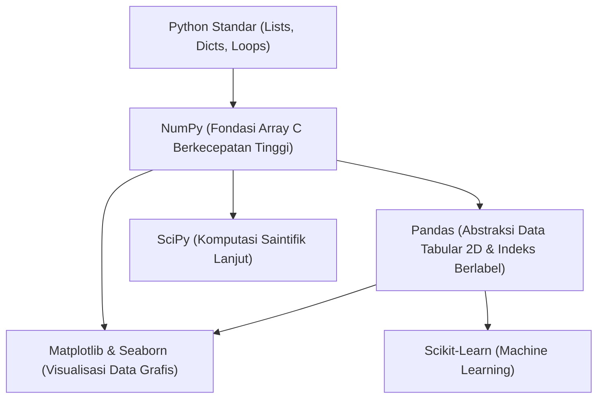

# Panduan Lengkap NumPy dan Pandas untuk Pengolahan Data

Dokumen ini merupakan panduan referensi komprehensif mengenai **NumPy** dan **Pandas**, dua pustaka (*library*) fondasional dalam ekosistem Python untuk analisis data, manipulasi tabular, komputasi saintifik, dan visualisasi data. Panduan ini dirancang untuk mendampingi berkas praktikum [Praktikum3_GathanHilabi_60324059.ipynb](file:///c:/Users/LENOVO/Documents/PERSONAL%20GATHAN/PROJECT%202026/VISUALISASI%20DATA/VD_03/Praktikum3_GathanHilabi_60324059.ipynb).

---

## 📑 Daftar Isi

1. [Pendahuluan: Ekosistem Python untuk Sains Data](#1-pendahuluan-ekosistem-python-untuk-sains-data)
2. [Bagian I: Panduan Lengkap NumPy](#2-bagian-i-panduan-lengkap-numpy)
   - [2.1 Mengapa NumPy Dibutuhkan?](#21-mengapa-numpy-dibutuhkan)
   - [2.2 Objek Inti: ndarray](#22-objek-inti-ndarray)
   - [2.3 Pembuatan Array](#23-pembuatan-array)
   - [2.4 Operasi Matematika & Vektorisasi](#24-operasi-matematika--vektorisasi)
   - [2.5 Fungsi Statistik dan Agregasi](#25-fungsi-statistik-dan-agregasi)
   - [2.6 Indexing, Slicing, dan Filtering](#26-indexing-slicing-dan-filtering)
   - [2.7 Komparasi Presisi Numerik](#27-komparasi-presisi-numerik)
   - [2.8 Bedah Kode NumPy pada Praktikum 3](#28-bedah-kode-numpy-pada-praktikum-3)
3. [Bagian II: Panduan Lengkap Pandas](#3-bagian-ii-panduan-lengkap-pandas)
   - [3.1 Filosofi dan Konsep Dasar Pandas](#31-filosofi-dan-konsep-dasar-pandas)
   - [3.2 Struktur Data: Series vs DataFrame](#32-struktur-data-series-vs-dataframe)
   - [3.3 Input & Output Data Tabular](#33-input--output-data-tabular)
   - [3.4 Eksplorasi Awal Data (EDA Fundamentals)](#34-eksplorasi-awal-data-eda-fundamentals)
   - [3.5 Akses Kolom, Baris, dan Boolean Indexing](#35-akses-kolom-baris-dan-boolean-indexing)
   - [3.6 Pembersihan Data: Missing Value](#36-pembersihan-data-missing-value)
   - [3.7 Pembersihan Data: Duplikasi Baris](#37-pembersihan-data-duplikasi-baris)
   - [3.8 Bedah Kode Pandas pada Praktikum 3](#38-bedah-kode-pandas-pada-praktikum-3)
4. [Bagian III: Perbandingan dan Integrasi NumPy vs Pandas](#4-bagian-iii-perbandingan-dan-integrasi-numpy-vs-pandas)
   - [4.1 Matriks Perbandingan Fitur](#41-matriks-perbandingan-fitur)
   - [4.2 Hubungan Arsitektur: Bagaimana Keduanya Bekerja Sama](#42-hubungan-arsitektur-bagaimana-keduanya-bekerja-sama)
   - [4.3 Kapan Menggunakan NumPy vs Pandas?](#43-kapan-menggunakan-numpy-vs-pandas)
5. [Bagian IV: Cheatsheet Sintaks Cepat (Quick Reference)](#5-bagian-iv-cheatsheet-sintaks-cepat-quick-reference)
6. [Referensi Resmi](#6-referensi-resmi)

---

## 1. Pendahuluan: Ekosistem Python untuk Sains Data

Python adalah bahasa tingkat tinggi yang sangat populer, tetapi implementasi standarnya (CPython) memiliki keterbatasan kecepatan eksekusi untuk perulangan (*loop*) berskala jutaan elemen. Untuk mengatasi hal ini, ekosistem komputasi saintifik Python dibangun di atas fondasi:



- **NumPy** menyediakan struktur data biner kontinu yang ditulis dalam bahasa C/Fortran untuk kalkulasi angka dalam kecepatan mesin.
- **Pandas** membungkus array NumPy ke dalam struktur tabel yang memiliki nama kolom (*header*) dan indeks baris, menyederhanakan manipulasi dataset nyata (seperti CSV, Excel, SQL).

---

## 2. Bagian I: Panduan Lengkap NumPy

**NumPy** (*Numerical Python*) adalah pustaka standar de facto untuk komputasi numerik di Python.

```python
import numpy as np
```
> **Konvensi Standar:** Selalu gunakan alias `np` saat mengimpor NumPy.

### 2.1 Mengapa NumPy Dibutuhkan?

Perhatikan perbandingan antara **List Python Standar** dengan **NumPy Array**:

| Aspek | List Python Standar | NumPy Array (`ndarray`) |
| :--- | :--- | :--- |
| **Penyimpanan Memori** | Menyimpan pointer ke objek Python (tiap elemen memiliki overhead besar). | Data homogen disimpan berurutan (*contiguous memory block*) tanpa overhead pointer. |
| **Kecepatan Operasi** | Membutuhkan perulangan `for` eksplisit di level interpretasi Python. | Menggunakan komputasi vektor (*vectorized operations*) yang dikompilasi langsung di tingkat CPU/C. |
| **Tipe Data** | Heterogen (bisa mencampur `int`, `str`, `float` dalam satu list). | Homogen (seluruh elemen wajib bertipe data sama, misalnya `float64`). |
| **Dukungan Dimensi** | List di dalam list (kurang intuitif untuk operasi matriks multi-dimensi). | Mendukung N-dimensi secara native dengan manipulasi bentuk (*shape*) yang fleksibel. |

### 2.2 Objek Inti: `ndarray`

Objek utama dalam NumPy adalah `np.ndarray` (*N-dimensional array*). Atribut penting pada array:
- `array.ndim`: Menunjukkan jumlah dimensi (1D = vektor, 2D = matriks, 3D+ = tensor).
- `array.shape`: Tuple yang menyatakan ukuran di setiap dimensi, misal `(5,)` untuk 1D atau `(3, 4)` untuk 2D.
- `array.size`: Total banyaknya elemen di dalam array.
- `array.dtype`: Tipe data elemen (contoh: `int32`, `int64`, `float64`).

### 2.3 Pembuatan Array

```python
# 1. Dari list biasa
arr1 = np.array([10, 20, 30, 40])

# 2. Array 2 dimensi (matriks)
arr2d = np.array([[1, 2, 3], [4, 5, 6]])

# 3. Array dengan nilai awal seragam
nol = np.zeros((3, 3))       # matriks 3x3 berisi angka 0.0
satu = np.ones((2, 4))       # matriks 2x4 berisi angka 1.0

# 4. Rentang deret angka berurutan
rentang = np.arange(0, 10, 2)       # [0, 2, 4, 6, 8] (mirip range di Python)
linear = np.linspace(0, 1, 5)       # [0.0, 0.25, 0.5, 0.75, 1.0] (5 titik terbagi rata)
```

### 2.4 Operasi Matematika & Vektorisasi

Salah satu keunggulan terbesar NumPy adalah **operasi tanpa loop** (*vectorization*):

```python
a = np.array([1, 2, 3, 4])
b = np.array([10, 20, 30, 40])

# Operasi element-wise
print(a + b)   # array([11, 22, 33, 44])
print(a * 2)   # array([ 2,  4,  6,  8])  -> Broadcasting skalar
print(b / a)   # array([10., 10., 10., 10.])
print(a ** 2)  # array([ 1,  4,  9, 16])
```

### 2.5 Fungsi Statistik dan Agregasi

NumPy menyediakan fungsi matematika ringkas berkinerja tinggi:

```python
nilai = np.array([78, 85, 90, 65, 72])

np.mean(nilai)      # Rata-rata aritmatika (mean) = 78.0
np.median(nilai)    # Nilai tengah setelah diurutkan = 78.0
np.min(nilai)       # Nilai minimum = 65
np.max(nilai)       # Nilai maksimum = 90
np.std(nilai)       # Deviasi standar = 8.92188...
np.var(nilai)       # Variansi (std kuadrat) = 79.6
np.sum(nilai)       # Total penjumlahan elemen = 390
```

### 2.6 Indexing, Slicing, dan Filtering

```python
data = np.array([15, 25, 35, 45, 55])

# Slicing dasar [start:stop:step]
print(data[1:4])     # array([25, 35, 45])

# Boolean Masking (filtering)
mask = data > 30     # array([False, False,  True,  True,  True])
print(data[mask])    # array([35, 45, 55])
```

### 2.7 Komparasi Presisi Numerik

Komputer menyimpan angka pecahan berkoma menggunakan format biner IEEE 754, yang terkadang menimbulkan perbedaan digit desimal di ujung pembulatan (misalnya `0.1 + 0.2 == 0.3` menghasilkan `False`).
Oleh karena itu, NumPy menyediakan:

```python
# Komparasi aman dengan batas toleransi relatif & absolut
np.isclose(a, b)      # Mengembalikan boolean tunggal / array boolean
np.allclose(a, b)     # Mengembalikan True jika seluruh elemen array cocok
```

### 2.8 Bedah Kode NumPy pada Praktikum 3

Di notebook [Praktikum3_GathanHilabi_60324059.ipynb](file:///c:/Users/LENOVO/Documents/PERSONAL%20GATHAN/PROJECT%202026/VISUALISASI%20DATA/VD_03/Praktikum3_GathanHilabi_60324059.ipynb), sintaks NumPy digunakan pada cell berikut:

#### 1. Cell Bagian 2 (Dasar Array NumPy)
```python
nilai_ujian = np.array([78, 85, 90, 65, 72])

print("Rata-rata:", np.mean(nilai_ujian))
print("Maksimum:", np.max(nilai_ujian))
print("Minimum:", np.min(nilai_ujian))
print(f"Std Deviasi: {np.std(nilai_ujian):.2f}")
```
- **`np.array([...])`**: Mengonversi deretan nilai ujian mahasiswa menjadi array satu dimensi.
- **`np.mean(...)`**: Menghitung rata-rata nilai kelas.
- **`np.max(...)` & `np.min(...)`**: Mengidentifikasi nilai tertinggi (90) dan terendah (65).
- **`np.std(...)`**: Menghitung variasi persebaran nilai (8.92).

#### 2. Cell Latihan 2 (Perbandingan NumPy vs Pandas)
```python
mean_numpy = np.mean(df["age"])
mean_pandas = df["age"].mean()

print("Apakah hasilnya sama? :", np.isclose(mean_numpy, mean_pandas))
```
- **`np.mean(df["age"])`**: NumPy dapat langsung menerima kolom Pandas Series (`df["age"]`) karena Series mengalirkan array NumPy internalnya ke fungsi komputasi.
- **`np.isclose(...)`**: Memvalidasi kesamaan hasil kalkulasi kedua pustaka secara aman terhadap presisi desimal biner komputer.

---
